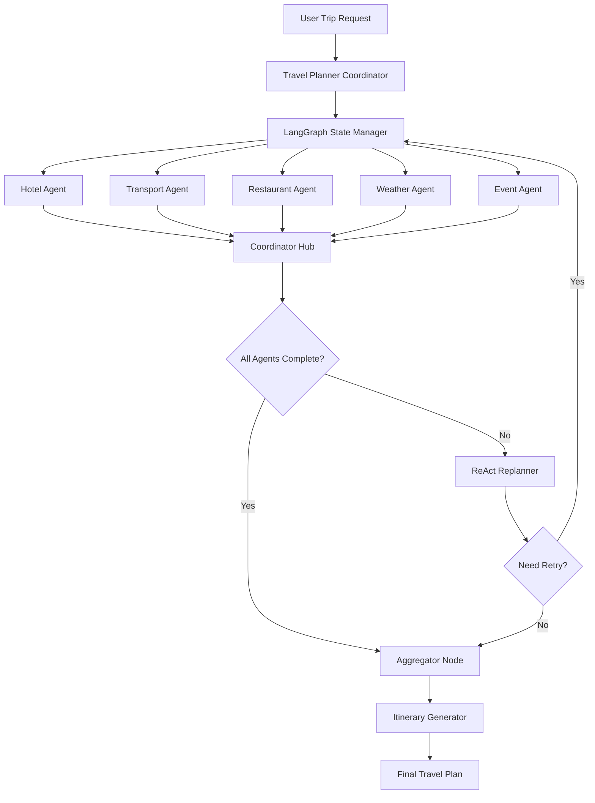

# Odysya


**Odysya** is an intelligent AI-powered travel planning system that creates comprehensive, personalized travel itineraries. Built with LangChain and LangGraph, it uses a multi-agent architecture to coordinate various travel services including hotels, restaurants, transportation, events, and weather forecasting.

## Features

### Advanced AI Planning
- **Multi-Agent Orchestration**: Six specialized AI agents working in coordination:
  - **Hotel Agent**: Searches accommodations based on budget, location, and preferences
  - **Transport Agent**: Plans optimal transportation routes and booking options
  - **Restaurant Agent**: Discovers dining experiences matching user tastes and dietary requirements
  - **Weather Agent**: Provides real-time forecasts to optimize activity planning
  - **Event Agent**: Finds local events, attractions, and cultural experiences
  - **Itinerary Agent**: Synthesizes all information into a coherent daily schedule

### Intelligent Decision Making
- **ReAct Methodology**: Think-Act-Decide framework for intelligent problem-solving
- **Adaptive Replanning**: Automatically detects suboptimal results and reruns specific agents
- **Constraint Satisfaction**: Ensures all recommendations meet budget, time, and preference constraints
- **Failure Recovery**: Graceful handling of API failures with intelligent fallback strategies

### Seamless Integration with Real-Time Data
- **Model Context Protocol (MCP)**: Standardized interface for external service integration
- **Async Processing**: Non-blocking operations for optimal performance
- **Type-Safe Data Models**: Pydantic models ensure data integrity across all components
- **Extensible Architecture**: Easy addition of new agents and services

### Personalization Engine
- **Preference Learning**: Adapts recommendations based on user interests and past choices
- **Cultural Sensitivity**: Considers local customs and cultural preferences
- **Accessibility Support**: Plans accessible routes and accommodations when needed
- **Dietary Restrictions**: Handles complex dietary requirements and allergies


## Architecture

Odysya implements a sophisticated **Multi-Agent System (MAS)** built on **LangGraph** for orchestrating complex travel planning workflows. The architecture follows the **Actor Model** pattern with intelligent coordination and state management.

### System Flow Architecture



### Detailed Component Architecture

#### 1. **LangGraph State Management**
```python
class PlannerState(TypedDict):
    trip: TripRequest
    retries: List[str]
    done: bool
    notes: str
    hotel_result: Optional[AgentResponse]
    transport_result: Optional[AgentResponse]
    restaurant_result: Optional[AgentResponse]
    weather_result: Optional[AgentResponse]
    event_result: Optional[AgentResponse]
    aggregated_plan: Optional[Itinerary]
    final_itinerary: Optional[Dict]
```

#### 2. **Agent Coordination Pattern**
- **Parallel Execution**: All agents run concurrently for optimal performance
- **State Synchronization**: Centralized state ensures data consistency
- **Conditional Routing**: LangGraph manages execution flow based on completion status
- **Error Isolation**: Agent failures don't cascade to other components

#### 3. **ReAct Intelligence Framework**
The **ReplanAgent** implements the ReAct (Reason-Act-Observe) methodology:

```
┌─────────────┐
│   THINK     │ ──→ Analyze current results against requirements
│             │     Check budget constraints, preferences, availability
└─────────────┘
        │
        ▼
┌─────────────┐
│     ACT     │ ──→ Identify specific issues and improvement areas
│             │     Determine which agents need rerunning
└─────────────┘
        │
        ▼
┌─────────────┐
│   DECIDE    │ ──→ Make concrete decisions about next steps
│             │     Generate specific retry instructions
└─────────────┘
```

### Layered Architecture

#### **Application Layer**
- **Travel Planner**: Main orchestration engine
- **Agent Coordinators**: Manage agent lifecycle and communication
- **State Managers**: Handle state transitions and persistence

#### **Business Logic Layer**
- **Specialized Agents**: Domain-specific AI agents with dedicated responsibilities
- **ReAct Planner**: Intelligent decision-making and replanning logic
- **Aggregation Engine**: Synthesizes multi-agent results into coherent plans

#### **Service Layer**
- **MCP Clients**: Standardized interfaces for external service communication
- **Tool Abstractions**: Service-specific tools and utilities
- **Data Transformers**: Format conversion and data normalization

#### **Infrastructure Layer**
- **MCP Servers**: Expose internal services via Model Context Protocol
- **HTTP Clients**: Robust HTTP communication with retry logic
- **Logging & Monitoring**: Comprehensive observability and error tracking

## Installation

### Prerequisites

- Python 3.13+
- pip or uv package manager

### Quick Start

1. **Clone the repository**
   ```bash
   git clone https://github.com/pranayyb/odysya.git
   cd odysya
   ```

2. **Install dependencies**
   ```bash
   # Using uv (recommended)
   uv sync

   # Or using pip
   pip install -e .
   ```

3. **Set up environment variables**
   ```bash
   cp .env.example .env
   # Edit .env with your API keys
   ```

4. **Configure API Keys**
   Add the following to your `.env` file:
   ```env
   GROQ_API_KEY=your_groq_api_key_here
   # Add other service API keys as needed
   ```


### Running the Application

```bash
# Run the main application
uv run main.py

# Or run specific agents
uv run -m agents.hotel_agent
uv run -m agents.restaurant_agent
```

## Configuration

Odysya supports various configuration options through `config.py`:

```python
# Model Configuration
MODEL_NAME = "llama-3.3-70b-versatile"

# Mock Mode Settings (for development/testing)
TRANSPORT_MOCK_BOOL = True
WEATHER_MOCK_BOOL = True  
RESTAURANT_MOCK_BOOL = True
EVENT_MOCK_BOOL = True
HOTEL_MOCK_BOOL = True
```

## Project Structure

```
odysya/
├── agents/                # AI agents for different services
│   ├── planner_agent.py   # Main coordination agent
│   ├── hotel_agent.py     # Hotel search and booking
│   ├── restaurant_agent.py # Restaurant recommendations
│   ├── transport_agent.py # Transportation planning
│   ├── weather_agent.py   # Weather forecasting
│   ├── event_agent.py     # Event discovery
│   └── itinerary_agent.py # Itinerary generation
├── models/                # Pydantic data models
│   ├── trip_request.py    # Trip request schema
│   ├── itinerary.py       # Itinerary data model
│   ├── hotel.py           # Hotel data model
│   └── ...
├── clients/               # MCP clients for external services
├── servers/               # MCP servers
├── tools/                 # Service-specific tools
├── interfaces/            # Abstract interfaces
├── utils/                 # Utility functions
├── data/                  # Mock data for testing
└── logs/                  # Application logs
```

## API Integration

Odysya integrates with various external services through the Model Context Protocol (MCP):

- **Hotels**: Hotel booking and search APIs
- **Restaurants**: Restaurant discovery and reviews
- **Transportation**: Flight, train, and local transport APIs
- **Events**: Local events and activities
- **Weather**: Real-time weather forecasting

## Testing (Later)

```bash
# Run tests
pytest

# Run specific test modules
pytest tests/test_agents.py
pytest tests/test_models.py

# Run with coverage
pytest --cov=odysya
```

## Development

### Adding New Agents

1. Create a new agent class inheriting from the base agent interface
2. Implement required methods for your service
3. Add corresponding models and tools
4. Register the agent in the main planner graph

### Mock Mode

For development and testing, Odysya supports mock mode where external API calls are replaced with mock data:

```python
# Enable mock mode in config.py
HOTEL_MOCK_BOOL = True
RESTAURANT_MOCK_BOOL = True
```

## License

This project is licensed under the MIT License - see the [LICENSE](LICENSE) file for details.

## Acknowledgments

- [LangChain](https://langchain.com/) for the AI framework
- [LangGraph](https://langgraph.com/) for multi-agent orchestration
- [Groq](https://groq.com/) for fast inference
- [Model Context Protocol](https://modelcontextprotocol.io/) for service integration

## Roadmap!!

### Performance & Infrastructure
- [ ] Switching to GO servers for faster concurrent fetching
- [ ] Real-time booking capabilities
- [ ] Cost optimization algorithms

### Platform & Accessibility
- [ ] Mobile application
- [ ] Text-to-Speech (TTS) integration for voice-guided itineraries
- [ ] Voice commands for hands-free travel planning

### Social & Collaborative Features
- [ ] Collaborative trip planning with shared itineraries
- [ ] Travel buddy matching system (connect travelers going to same destination/dates)
- [ ] Group travel coordination and split expense tracking
- [ ] Social recommendations from fellow travelers

### Integration & Productivity
- [ ] Gmail integration for automatic booking confirmations and updates
- [ ] Google Calendar/Outlook calendar synchronization
- [ ] Slack/Teams integration for team travel planning
- [ ] WhatsApp/Telegram bot for quick trip updates

### AI & Personalization
- [ ] Advanced preference learning with ML models
- [ ] Multi-destination planning with route optimization
- [ ] Predictive rebooking based on travel pattern analysis
- [ ] Smart travel alerts and recommendations

### Sustainability & Analytics
- [ ] Carbon footprint tracking and eco-friendly alternatives
- [ ] Travel analytics dashboard with insights and trends
- [ ] Sustainable travel recommendations and certifications

---

**Made with ❤️ for travelers by a traveler**