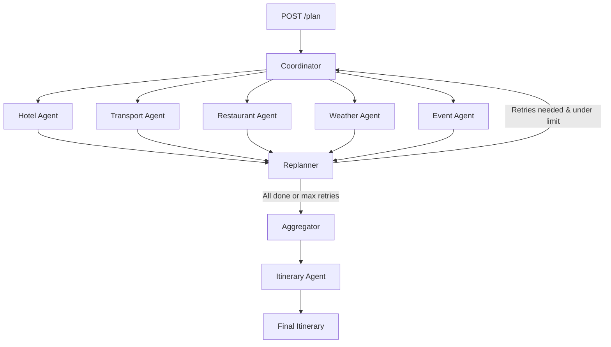

# Odysya


**Odysya** is an AI-powered travel planning system that creates personalized travel itineraries. Built with LangGraph and served via FastAPI, it uses a multi-agent architecture to coordinate hotels, restaurants, transportation, events, and weather data — then synthesizes everything into a detailed day-by-day itinerary.

## Features

### Multi-Agent Orchestration
Six specialized AI agents run in parallel, each handling a different aspect of trip planning:

- **Hotel Agent** — Searches accommodations based on budget, location, and dates
- **Transport Agent** — Finds transport options (flights, trains, buses) to the destination
- **Restaurant Agent** — Discovers dining options matching user preferences
- **Weather Agent** — Provides weather forecasts for the travel dates
- **Event Agent** — Finds local events and activities happening during the trip
- **Itinerary Agent** — Synthesizes all collected data into a coherent daily schedule

### Intelligent Replanning
- **Adaptive Retry Logic** — The ReplanAgent analyzes agent results and selectively retries failed agents (up to 3 attempts)
- **Graceful Degradation** — If agents fail after retries, the itinerary is generated with the best available data
- **Fan-out/Fan-in Pattern** — Agents execute concurrently and converge at the replanner for evaluation

### Technical Highlights
- **FastAPI** endpoint for HTTP access (`POST /plan`)
- **Model Context Protocol (MCP)** for standardized agent-to-server communication via stdio
- **LangGraph StateGraph** for orchestrating the concurrent multi-agent workflow
- **Pydantic** models for type-safe data throughout the pipeline
- **Groq** (LLaMA 3.3 70B) as the LLM backend
- **Mock mode** for development/testing without external API keys

## Architecture

### Graph Flow



### Data Flow

```
TripRequest → Coordinator → Agents (parallel) → MCP Clients → MCP Servers (stdio)
                                                      ↓
                                               Tool Results
                                                      ↓
                                          Structured Pydantic Models
                                                      ↓
                                    Replanner (retry or proceed)
                                                      ↓
                                         Aggregator (assemble Itinerary)
                                                      ↓
                                    Itinerary Agent (LLM generates day-by-day plan)
                                                      ↓
                                              JSON Response
```

### Layered Architecture

| Layer | Components |
|-------|-----------|
| **API** | FastAPI app (`main.py`) — `/health`, `/plan` endpoints |
| **Orchestration** | LangGraph StateGraph (`planner_agent.py`) — coordinator, replanner, aggregator, itinerary nodes |
| **Agents** | Domain agents (`hotel_agent.py`, etc.) — query tools, format results via LLM |
| **Tools** | Tool wrappers (`hotel_tools.py`, etc.) — connect to MCP clients |
| **MCP Clients** | Client interfaces (`hotel_mcp_client.py`, etc.) — connect to servers via stdio, use LLM for tool selection |
| **MCP Servers** | Server implementations (`hotel_mcp_server.py`, etc.) — expose tools, fetch data (mock or API) |
| **Infrastructure** | Logger, error handler, HTTP client with retry, validator |

## Installation

### Prerequisites

- Python 3.13+
- [uv](https://docs.astral.sh/uv/) package manager (recommended)

### Setup

1. **Clone the repository**
   ```bash
   git clone https://github.com/pranayyb/odysya.git
   cd odysya
   ```

2. **Install dependencies**
   ```bash
   uv sync
   ```

3. **Configure environment variables**
   ```bash
   cp .env.example .env
   ```
   Add your API keys to `.env`:
   ```env
   GROQ_API_KEY=your_groq_api_key_here

   # Optional — external service keys (mock mode is used if not set)
   RAPIDAPI_KEY=
   YELP_API_KEY=
   OPENWEATHER_API_KEY=
   EVENTS_API_KEY=
   TRANSPORT_API_KEY=
   ```

### Running

```bash
uv run main.py
```

## API Usage

### Health Check

```bash
curl http://localhost:8000/health
```

### Plan a Trip

```bash
curl -X POST http://localhost:8000/plan \
  -H "Content-Type: application/json" \
  -d '{
    "destination": "Mumbai",
    "start_date": "2025-06-01",
    "end_date": "2025-06-05",
    "preferences": ["food", "culture"],
    "budget": 2000.0
  }'
```

**Response:**
```json
{
  "success": true,
  "destination": "Mumbai",
  "detailed_itinerary": "This is the proposed itinerary for a 5-day trip to Mumbai from 2025-06-01 to 2025-06-05, focused on local food experiences and key city attractions. It provides a day-by-day plan while accounting for preferences, weather conditions, and practical travel considerations...",
  "key_recommendations": [
    "Check weather updates before outdoor activities",
    "Stay within $2000 budget",
    "Focus on food activities",
    "Book accommodations and transport in advance",
    "Keep backup plans for weather-dependent activities"
  ],
  "retry_count": 3,
  "notes": "The system expanded the search by increasing the budget to $2500 and retried hotel and event discovery to improve overall results."
}

```

### Request Schema

| Field | Type | Required | Description |
|-------|------|----------|-------------|
| `destination` | string | Yes | Travel destination |
| `start_date` | string | Yes | Trip start date (YYYY-MM-DD) |
| `end_date` | string | Yes | Trip end date (YYYY-MM-DD) |
| `preferences` | list[string] | No | Interests (e.g. `["food", "adventure"]`) |
| `budget` | float | No | Total trip budget in USD |

## Configuration

All configuration is in `config.py` and can be overridden with environment variables:

| Variable | Default | Description |
|----------|---------|-------------|
| `MODEL_NAME` | `llama-3.3-70b-versatile` | Groq LLM model |
| `GROQ_API_KEY` | — | Required. Groq API key |
| `MAX_AGENT_RETRIES` | `3` | Max replanner retry cycles |
| `LOG_LEVEL` | `INFO` | Logging level (`DEBUG`, `INFO`, `WARNING`, `ERROR`) |
| `HOTEL_MOCK` | `True` | Use mock hotel data |
| `TRANSPORT_MOCK` | `True` | Use mock transport data |
| `RESTAURANT_MOCK` | `True` | Use mock restaurant data |
| `WEATHER_MOCK` | `True` | Use mock weather data |
| `EVENT_MOCK` | `True` | Use mock event data |

## Project Structure

```
odysya/
├── main.py                 # FastAPI app — /health, /plan endpoints
├── config.py               # Configuration and environment variables
├── agents/                 # AI agents
│   ├── planner_agent.py    # LangGraph StateGraph orchestration
│   ├── replanner_agent.py  # ReplanAgent — retry logic
│   ├── itinerary_agent.py  # Generates final itinerary via LLM
│   ├── hotel_agent.py      # Hotel search + structured output
│   ├── restaurant_agent.py # Restaurant search + structured output
│   ├── transport_agent.py  # Transport search + structured output
│   ├── weather_agent.py    # Weather forecast + structured output
│   └── event_agent.py      # Event search + structured output
├── clients/                # MCP clients (connect to servers via stdio)
│   ├── hotel_mcp_client.py
│   ├── restaurant_mcp_client.py
│   ├── transport_mcp_client.py
│   ├── weather_mcp_client.py
│   └── event_mcp_client.py
├── servers/                # MCP servers (expose tools, fetch data)
│   ├── hotel_mcp_server.py
│   ├── restaurant_mcp_server.py
│   ├── transport_mcp_server.py
│   ├── weather_mcp_server.py
│   └── event_mcp_server.py
├── tools/                  # Tool wrappers connecting agents to MCP clients
├── models/                 # Pydantic data models
│   ├── trip_request.py     # Input request schema
│   ├── planner_state.py    # LangGraph state definition
│   ├── itinerary.py        # Aggregated plan model
│   ├── agent_response.py   # Standardized agent result wrapper
│   ├── hotel.py            # Hotel/HotelItem models
│   ├── restaurant.py       # Restaurant/RestaurantItem models
│   ├── transport.py        # Transport/TransportItem models
│   ├── weather.py          # Weather/WeatherItem models
│   └── event.py            # Event/EventItem models
├── interfaces/             # Abstract base classes
│   ├── mcp_client_interface.py  # Base MCP client with LLM tool selection
│   ├── mcp_server_interface.py  # Base MCP server interface
│   └── tool_interface.py        # Base tool interface
├── prompts/                # LLM prompt templates
│   ├── itinerary_prompts.py     # Itinerary generation prompts
│   └── replanner_prompts.py     # Replanner analysis prompts
├── utils/                  # Utilities
│   ├── logger.py           # Structured file + console logging
│   ├── error_handler.py    # Typed error classes (AgentError, ToolError, etc.)
│   ├── http_client.py      # HTTP client with retry + exponential backoff
│   ├── validator.py        # Trip request validation
│   └── pretty_print.py     # Output formatting
├── data/                   # Mock data and user profiles
│   ├── hotel_data.py
│   ├── restaurant_data.py
│   ├── transport_data.py
│   ├── weather_data.py
│   ├── events_data.py
│   └── user_profiles/
└── logs/                   # Application logs (gitignored)
```

## Development

### Adding a New Agent

1. Create the data model in `models/` (Pydantic `BaseModel`)
2. Add mock data in `data/`
3. Create the MCP server in `servers/` (inherit `MCPServerInterface`)
4. Create the MCP client in `clients/` (inherit `MCPClient`)
5. Create the tool wrapper in `tools/` (inherit `ToolInterface`)
6. Create the agent in `agents/`
7. Register the node and edges in `planner_agent.py`

### Mock Mode

All servers run in mock mode by default, returning sample data without needing external API keys. Set the `*_MOCK` environment variables to `False` to use real APIs.

## License

This project is licensed under the MIT License — see the [LICENSE](LICENSE) file for details.

## Acknowledgments

- [LangChain](https://langchain.com/) — AI framework
- [LangGraph](https://langgraph.com/) — Multi-agent orchestration
- [Groq](https://groq.com/) — Fast LLM inference
- [FastAPI](https://fastapi.tiangolo.com/) — HTTP API framework
- [Model Context Protocol](https://modelcontextprotocol.io/) — Service integration standard

---

**Made with ❤️ for travelers by a traveler**